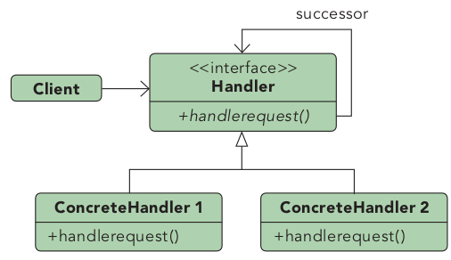

# Structural Patterns

## Overview

- [Chain of Responsibility](#chain-of-responsibility): Sequence of handlers processing events one after the other.
- : .
- : .
- : .
- : .

## Chain of Responsibility

**A chain of components who all get a change to process a command, optionally having default implementations and the ability to stop the processing chain.**

Example: GUI processing of user input: Button -> Button Container -> Window frame -> Window -> Desktop. 

**(decentralized) Pointer Chain**: Linked List of commands. Each component of the chain works on the object and gives it to the next one, possibly breaking the chain. This is how this pattern used to be implemented in the past.

**(centralized) Signal Chain**: Observer pattern is used to signal components who can participate in the chain. A central component keeps a list of the elements who could be influenced by the chain. The commands are propagated (sent) to the centralized server, and used by each element to traverse the chain and apply modifications when needed.

**Broker Chain:** Chain of Responsibility + Observer + Command Query Separation.
