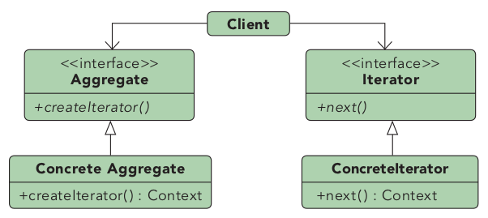
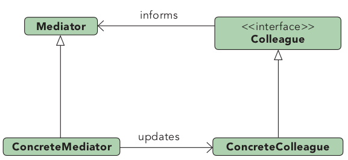
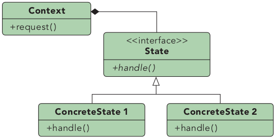
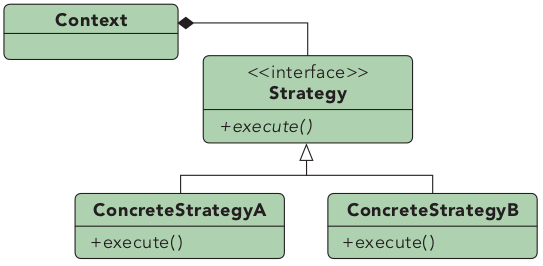
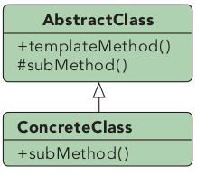
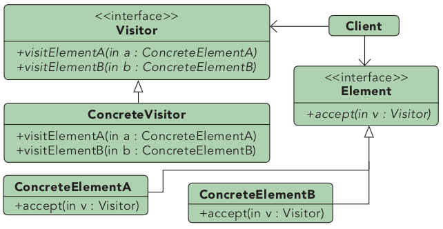

# Behavioral Patterns

## Overview

- [Chain of Responsibility](#chain-of-responsibility): Sequence of handlers processing events one after the other.
- [Commmad](#command): Encapsulate commands into separate objects.
- [Interpreter](#interpreter): Lexing and parsing structured data.
- [Iterator](#iterator): Facilitates the traversal of data structures.
- [Mediator](#mediator): Centralized communication between objects.
- [Memento](#memento): Keep a snapshot of an object's state to return later.
- [Observer](#observer): Publish and subscribe to messages.
- [State](#state): TODO.
- [Strategy](#strategy): TODO.
- [Template Method](#template-method): TODO.
- [Visitor](#visitor): TODO.

## Chain of Responsibility

**A chain of components who all get a change to process a command, optionally having default implementations and the ability to stop the processing chain.**

Example: GUI processing of user input: Button -> Button Container -> Window frame -> Window -> Desktop. 

**(decentralized) Pointer Chain**: Linked List of commands. Each component of the chain works on the object and gives it to the next one, possibly breaking the chain. This is how this pattern used to be implemented in the past.

**(centralized) Signal Chain**: Observer pattern is used to signal components who can participate in the chain. A central component keeps a list of the elements who could be influenced by the chain. The commands are propagated (sent) to the centralized server, and used by each element to traverse the chain and apply modifications when needed.

**Broker Chain:** Chain of Responsibility + Observer + Command Query Separation.

## Command

**Encapsulate all details of an operation in a separate object. The object must define methods to apply the command, and possibly to undo or rollback.**

Example: The encapsulated action can be used to implement features like: multi-level undo/redo, macro recording, undo/redo, and having different GUI buttons generate the same commands.

**Command Query Separation**: This is not part of the Command Design Pattern. This is an architectural pattern allowing the separation of command and query concerns:
- *Command*: Asking for an action (usually a change). No return value. e.g., Please set attack to 12.
- *Query*: Asking for information (usually read-only). Return Value. e.g., Please give me your attack value.
* Both *commands* and *queries* are an instantiation of the command design pattern.

**Composite Command**: By using the composite pattern, commands can be grouped into composed commands like macros. The problem becomes difficult when trying to maintain consistency between operations: if multiple elements are affected, any failure should be properly dealt with (for instance, using rollback semantics).

**Examples:**
- [command](command/command.cpp)
- [command undo](command/command_undo.cpp)
- [composite command (macro)](command/composite_command.cpp)

## Interpreter

**A component that processes structured text data. Does so by turning it into separate lexical tokens (lexing) and then interpreting sequences of said tokens (parsing).**

**Applications:**
- Parsers for compilers, interpreters, IDEs, static analysis tools.
- Matematical tools.
- Regular expressions.

**Examples:** [lexer_parser](interpreter/lexer_parser.cpp).

## Iterator

**A class that facilitates the traversal of a data structure. Keeps a reference to the current element and knows how to move to the next.**

**Considerations:**
- Iterator implementation usually requires operations: `operator!=()`, `operator++()`, and `operator*()`.
- Iterators can be used implicitly: range-based for, coroutines.
- Iterators are used a lot in STL containers.
- Iterators can be implemented to own data structures (like a tree).
- As the `operator++()` is called sporadically, so there is no way of preserving a recursion stack. This could lead to complex iterative implementations (e.g., on trees). The coroutine module (c++20) enables the use of the easy recursive approach through generator-yielding functions (yield allows keeping the recursion stack!).

**Examples:**
- [iterators_in_stl](iterator/iterators_in_stl.cpp)
- [binary_tree_iterator](iterator/binary_tree_iterator.cpp)
- [binary_tree_iterator_coroutines](iterator/binary_tree_iterator_coroutines.cpp)
- [boost_iterator_facade](iterator/boost_iterator_facade.cpp)

## Mediator

**Facilitates communication between components, by letting them be unaware of their presence or absence in the system.**

**Motivation:**
- Components may go in/out of the system at any time. e.g., chat room, mmorpg.
- It makes no sense to have direct references between participants.
- A mediator component is used to mediate the connections.

**Considerations:**
- Mediator is created and usually injected into every component.
- Mediator is usually a singleton.
- Mediator provides bidirectional communication.

**Examples:**
- [chat room](mediator/main.cpp)
- [soccer_event_broker](mediator/soccer_event_broker.cpp)

## Memento

**Keep a snapshot of an object's state to return later.**

**Motivation:**
- The command pattern allows undo/redo using commit-semantics, storing every single change!, while the memento simply saves snapshots of the system.

**Considerations:**
- A memento is a token/handler representing the system snapshot, which allows to rollback to that version. 
- This token may or may not contain system information. It may be just a hash returned by the API.
- The memento should be an inmutable object to avoid reverting to invalid states.
- Storing mementos allows using undo/redo.
- An alternative implementation could implement the "snapshot save" in the constructor of the token, and the "restore" in its destructor.

**Examples:**
- [memento snapshot](memento/memento.cpp).
- [memento with undo redo](memento/undo_redo.cpp).

## Observer

**Getting notifications on events: The observer subscribes to event notifications, which are generated by the observable.**

**Motivation:**
- Get notifications when events happen:
  - Object's field changes.
  - Object does something.
  - External event occurs.

**Considerations**:
- Observable (publisher) implementation is always intrusive.
- Observer (doesn't need to be).
- Issues with multithreading and reentrant cases (Boost signals is not thread safe).

**Terminology:**
- *event* is *published* and received by a *subscriber*.
- *signal* is *fired* and handled by a *slot* (boost, qt, ...).

**Examples:**
- [raw_observer](observer/raw_observer.cpp)
- [boost_observer](observer/boost_observer.cpp)
- [thread_safety](observer/thread_safety.cpp)

## State

**TODO: overview**

Applications:
- a
- b

Examples:
- 

## Strategy

**TODO: overview**

Applications:
- a
- b

Examples:
- 

## Template Method

**TODO: overview**

Applications:
- a
- b

Examples:
- 

## Visitor

**TODO: overview**

Applications:
- a
- b

Examples:
- 
