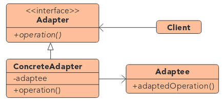
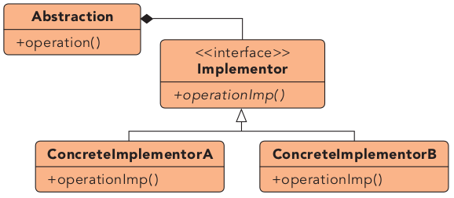
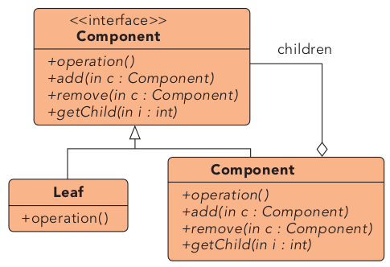
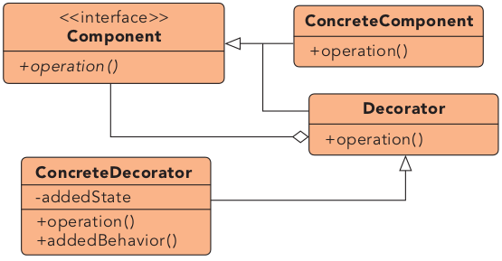
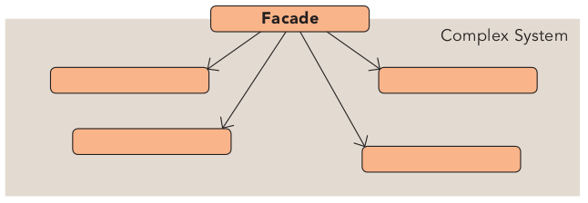
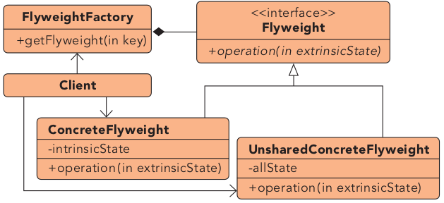
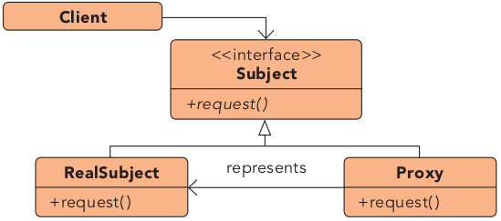

# Structural Patterns

## Overview

- [Adapter](#adapter): Adapts an interface X to conform with interface Y.
- [Bridge](#bridge): Connects components while decoupling their interfaces from the implementation.
- [Composite](#composite): Treats individual components and aggregate objects uniformly.
- [Decorator](#decorator): Extends functionality without modifying internal code.
- [Façade](#façade): Provides simple API to large codebase.
- [Flyweight](#flyweight): Optimizes memory usage by storing data externally for similar objects.
- [Proxy](#proxy): Provides an extra interface to a resource, adding functionallity in between.

## Adapter

**Getting the interface you want from the interface you have**

We cannot modify the whole API to support a specific interface, so we adapt an existing interface X to conform to the required interface Y.

**by inheritance**: The adapter implements the required interface and also privately derives from the Adaptee class.

**by external polymorphism**: When the adaptee functionality is separated into multiple classes, the adapter can be built using pointers to each of the objects and their relevant methods.

**adapter caching**: Sometimes the conversion logic requires the execution of expensive methods to transform static data. If we expect this to be executed many times, we can implement a caché.

## Bridge

**Connecting components together through abstractions. It decouples the interface (hierarchy) from the implementation (hierarchy).**

Helps preventing a entity explosion on a *cartesian product*. Example: An object that supports X and Y requirements, each one with 3 different implementations, would end up with 9 versions.

**Pimpl Idiom**: This usage of the pattern helps us hidding implementation details we do not want to expose. As a side feature, as the implementation and internal signatures are hidden, this idiom allows us to change the internal implementation without touching the consumer headers. This way, we do not introduce _binary incompatibility_ and compilation times are faster.

**Examples**:
- [pimpl idiom](bridge/pimpl_idiom.cpp)
- [pimpl library](bridge/pimpl_library.cpp)

## Composite

**Treating individual components and aggregate objects uniformly.**

Lets us group objects to make compound objects. E.g., nodes and leaves in a tree, groups of shapes. Then the individuals and groups have a common API. Both, singlular and composed objects share a similar behavior and use the same interface.

We can make use of C++ *duck typing*, expecting `begin` and `end` expressions to identify a collection.

## Decorator

**Facilitates the addition of behaviors to individual objects.**

It allows us to extend the class functionality without having to modify the internal code. Decorators can be nested.

**Dynamic Decorator**: Allows adding behavior and nesting decorators by keeping a reference to the decorated object. But, limits the object API only to the interface used by the decorators. However, this decorator is good when we do not know which decorator to use, and we want to pick them at runtime.

**Static Decorator**: When we know the decorator we want at compile time. It allows nesting and also keeping the same interface as the decorated class.

**Functional Decorator**: Applies extra features to functions.

## Façade

**Provides a simple and easy to understand user interface over a large and sophisticated body of code.**

Typical systems are complex and are build on top of many subsystems we do not want to expose. We use façade to provide a limited and simpler API to the consumer. It may allow users to escalate to a more complex API if they need to.

## Flyweight

**A space optimization technique that lets us use less memory by storing externally the data associated with similar objects.**

This pattern is already implemented as a boost library `boost::flyweight`.

Example: Do not store name/lastname pairs for each person, just keep a table of names and references to it.

## Proxy

**Interface to a particular resource. That resource may be remote, expensive or may require extra functionality. Keeps the original interface, but functionality is modified.**

There are different types of proxies for purposes like communication, caching, logging, virtual or guarding. Smart pointers are a common example of a proxy; they encapsulate the real pointer and add lifecycle logic, resulting in a extended API.

**Decorator vs. Proxy**:

- Proxy provides an identical interface, but Decorator provides an enhanced interface.
- Decorator typically aggregates/references a base object, while the proxy can be a new object, unrelated with the base.
- Decorator receives a reference to the augmented object, while the proxy does not.
- Decorator supports recursive composition.

**Property proxy**: Allows us to catch readings and assignements to the object properties, without the need of getters and setters.

**Virtual proxy**: Allows us to implement lazy behavior for expensive resources.

**Communication proxy**: Allows us to use a external server/process to solve a query.

